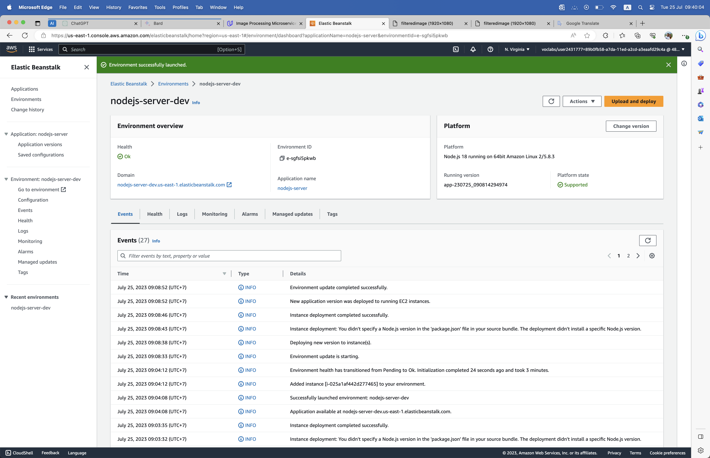
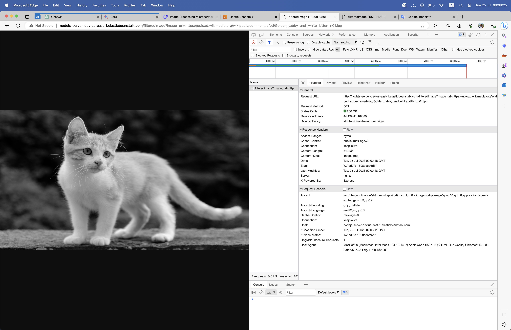
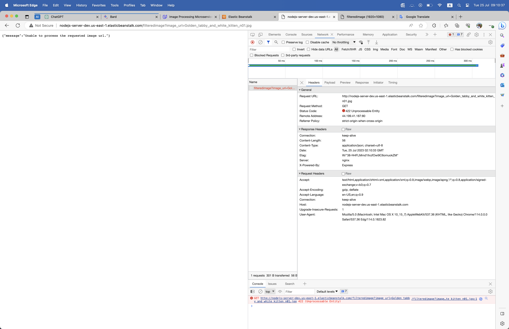

# Cloud Developer using AWS - Udacity - Project 02 - Image Processing Microservice on AWS

- [Cloud Developer using AWS - Udacity - Project 02 - Image Processing Microservice on AWS](#cloud-developer-using-aws---udacity---project-02---image-processing-microservice-on-aws)
  - [Project Overview](#project-overview)
  - [Installation](#installation)
    - [Setup aws account if you are using Udacity Account](#setup-aws-account-if-you-are-using-udacity-account)
    - [Clone the repository](#clone-the-repository)
    - [AWS CLI Configuration](#aws-cli-configuration)
    - [Elastic Beanstalk Overview](#elastic-beanstalk-overview)
    - [Browse the website](#browse-the-website)


## Project Overview

Help Find Missing People

You have been hired as a software engineer to develop an application that will help the FBI find missing people. The application will upload images to the FBI cloud database hosted in AWS. This will allow the FBI to run facial recognition software on the images to detect a match. You will be developing a NodeJS server and deploying it on AWS Elastic Beanstalk.

You will build upon the application we've developed during the lessons in this course. You'll complete a REST API endpoint in a backend service that processes incoming image URLs.

Starter Code
The project starter code can be found here: [Image Filter Starter Code](https://github.com/udacity/cd12099-Full-Stack-Apps-AWS) or in the Project Workspace page.

1. Dependencies:

   - [AWS account](https://aws.amazon.com/)
   - [AWS CLI](https://docs.aws.amazon.com/cli/latest/userguide/getting-started-install.html)
   - [Python to install EB CLI](https://www.python.org/downloads/)
   - [EB CLI](https://github.com/aws/aws-elastic-beanstalk-cli-setup)
   - [NodeJS](https://nodejs.org/en)
   - [Visual Studio Code](https://code.visualstudio.com/)

2. Topics Covered:
   - Restful API
   - Elastic Beanstalk
   - Deploy a Restful API using Elastic Beanstalk
   - Using API via web browser

## Installation

### Setup aws account if you are using Udacity Account

Create an IAM user
We will create an AWS IAM user, and copy its Access key.

1. Open AWS console.
2. Navigate to the IAM Dashboard, and create an IAM user.
3. Add a new IAM user
4. Set the permissions to the new user by attaching the AWS Managed AdministratorAccess policy from the list of existing policies.
5. After a user is created successfully, download the access key file (.csv) containing the Access Key ID and a Secret Access Key. You can even copy the keys and stay on the same page. Don’t skip this step as this will be your only opportunity to download the secret access key file.

### Clone the repository

Run code to clone the repository

```bash
git clone https://github.com/congdinh2008/aws-cloud-dev-udacity-prj2-full-stack-app.git
```

### AWS CLI Configuration

1. Check aws eb cli version
   ```bash
   eb --version
   ```
2. Elastic Beanstalk Configuration

- eb init
  ```bash
  eb init
  # AWS Access Key ID: Enter your AWS Access Key ID
  # AWS Secret Access Key: Enter your AWS AWS Secret Access Key
  # follow the steps with your choices
  ```
- eb create - to create a new eb instance and first deploy the application
  ```bash
  eb create
  # follow the steps with your choices
  ```
- eb deploy - re-deploy the application

### Elastic Beanstalk Overview



### Browse the website

1. Access Restful API Via Url:
   Url: http://[server-name-dev].[region].elasticbeanstalk.com/filteredimage?image_url=[image_url]

   Example: http://nodejs-server-dev.us-east-1.elasticbeanstalk.com/filteredimage?image_url=https://upload.wikimedia.org/wikipedia/commons/b/bd/Golden_tabby_and_white_kitten_n01.jpg

   

2. With wrong image url
   
